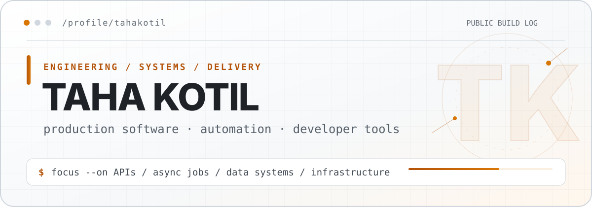

<p align="center">
  <picture>
    <source media="(max-width: 600px) and (prefers-color-scheme: dark)" srcset="./assets/profile-mobile-dark.svg">
    <source media="(max-width: 600px) and (prefers-color-scheme: light)" srcset="./assets/profile-mobile-light.svg">
    <source media="(prefers-color-scheme: dark)" srcset="./assets/profile-dark.svg">
    <source media="(prefers-color-scheme: light)" srcset="./assets/profile-light.svg">
    
  </picture>
</p>

<p align="center">
  <a href="https://x.com/tahakotilai"><strong>X</strong></a>
  &nbsp;·&nbsp;
  <a href="https://www.linkedin.com/in/tahakotil/"><strong>LinkedIn</strong></a>
</p>

I work where product code, asynchronous systems, and deployment meet. Most of my public work is in Python and TypeScript; the operating bias is simple: fewer moving parts, observable failures, and software that reaches production.

### `01 / SELECTED OPEN-SOURCE WORK`

- [Prometheus client_js #836](https://github.com/prometheus/client_js/pull/836) — Merged core metric-path fallback handling that preserves valid falsy values.
- [ESLint #21276](https://github.com/eslint/eslint/pull/21276) — Maintainer-approved `no-unreachable` fix for static imports with focused regression coverage.

### `02 / OPERATING RANGE`

```text
languages      Python · TypeScript · SQL
backend        FastAPI · async jobs · queues · webhooks
systems        PostgreSQL · Redis · stateful workflows
delivery       Docker · Linux · GitHub Actions · cloud infrastructure
```

<sub>Public profile assets are self-hosted in this repository. No generated stats, tracking pixels, or external theme service.</sub>
