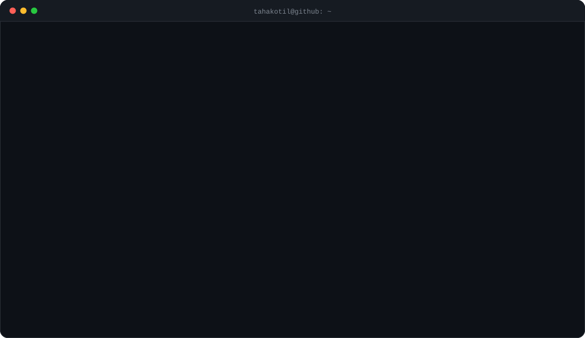
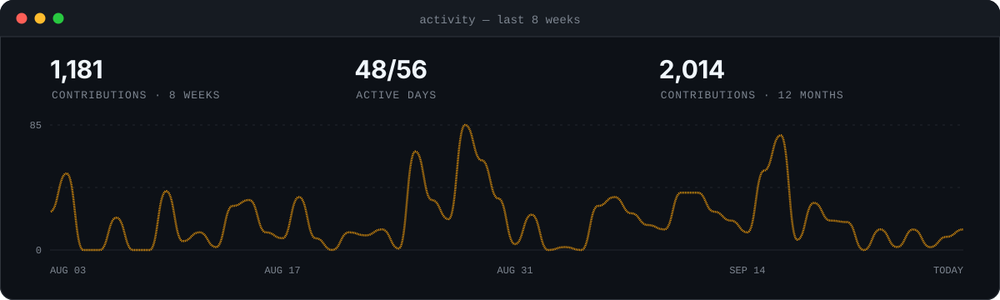

<!doctype html><html data-color-mode="dark"><head><meta charset="utf-8"><title>a2-identity (dark)</title>
<meta name="color-scheme" content="dark">
<link rel="stylesheet" href="../gh-dark.css">
</head><body>

tahakotil / README.md · a2-identity

<article class="markdown-body">

<strong>Software Engineer</strong> building production software — backend services, automation and AI agent tooling.
Mostly Python and TypeScript, shipped with Docker on Linux. Fewer moving parts, observable failures, software that reaches production.

<b>Open source</b> · 7 merged pull requests upstream

<table>
<thead>
<tr>
<th>Repository</th>
<th>PR</th>
<th>Change</th>
</tr>
</thead>
<tbody>
<tr>
<td><a href="https://github.com/eslint/eslint"><code>eslint/eslint</code></a></td>
<td><a href="https://github.com/eslint/eslint/pull/21276">#21276</a></td>
<td>fix: Ignore static imports in no-unreachable</td>
</tr>
<tr>
<td><a href="https://github.com/prometheus/client_js"><code>prometheus/client_js</code></a></td>
<td><a href="https://github.com/prometheus/client_js/pull/836">#836</a></td>
<td>perf: remove core metric fallback truthiness</td>
</tr>
<tr>
<td><a href="https://github.com/prometheus/client_js"><code>prometheus/client_js</code></a></td>
<td><a href="https://github.com/prometheus/client_js/pull/834">#834</a></td>
<td>test: cover memory metric helper fallbacks</td>
</tr>
<tr>
<td><a href="https://github.com/mozilla/pontoon"><code>mozilla/pontoon</code></a></td>
<td><a href="https://github.com/mozilla/pontoon/pull/4523">#4523</a></td>
<td>Fix obsolete Google Translate locale link</td>
</tr>
<tr>
<td><a href="https://github.com/mozilla/pontoon"><code>mozilla/pontoon</code></a></td>
<td><a href="https://github.com/mozilla/pontoon/pull/4459">#4459</a></td>
<td>Docs: Fix pretranslation guidelines link</td>
</tr>
<tr>
<td><a href="https://github.com/avenoxai/avenoxbeyin"><code>avenoxai/avenoxbeyin</code></a></td>
<td><a href="https://github.com/avenoxai/avenoxbeyin/pull/124">#124</a></td>
<td>fix(omp): doctor reports stale global hook copies as information-only</td>
</tr>
<tr>
<td><a href="https://github.com/avenoxai/avenoxbeyin"><code>avenoxai/avenoxbeyin</code></a></td>
<td><a href="https://github.com/avenoxai/avenoxbeyin/pull/85">#85</a></td>
<td>feat(omp): support OMP (Oh My Pi) as a sixth harness</td>
</tr>
</tbody>
</table>

<a href="https://x.com/tahakotildev" rel="nofollow">X</a>  ·  <a href="https://www.linkedin.com/in/tahakotil/" rel="nofollow">LinkedIn</a>  ·  <a href="https://github.com/pulls?q=author%3Atahakotil+is%3Amerged">All merged PRs</a>
</article>
</body></html>
